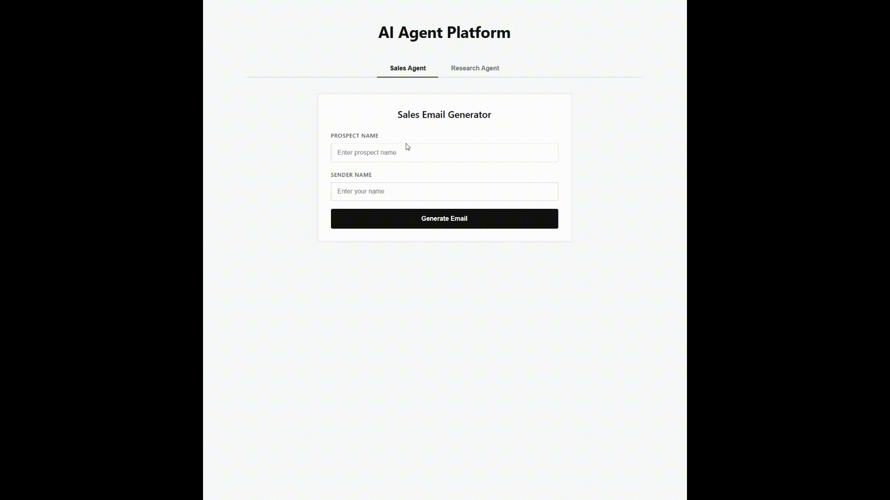
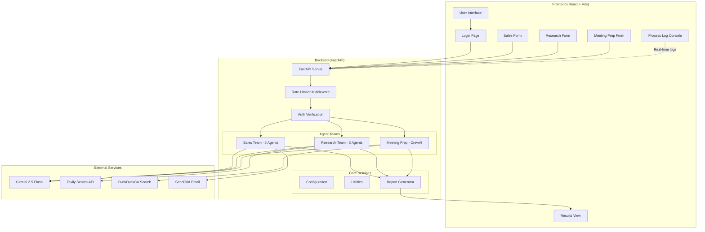
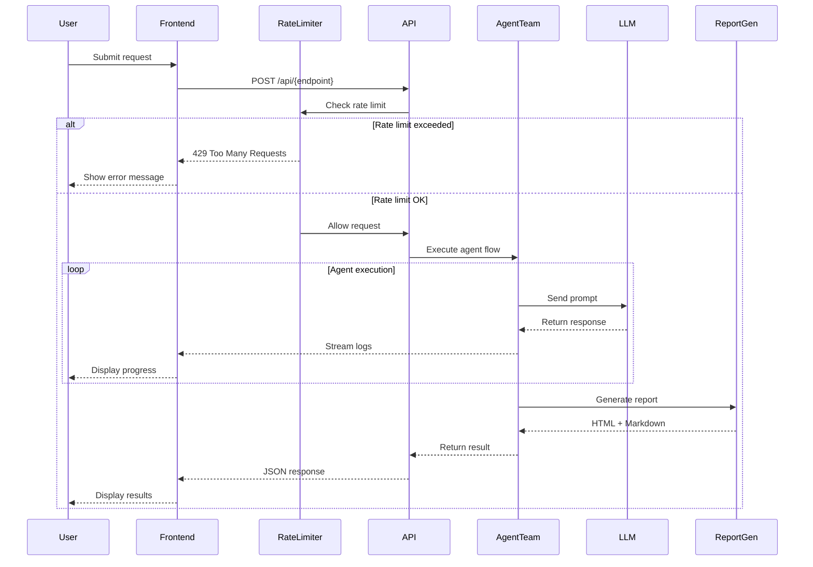
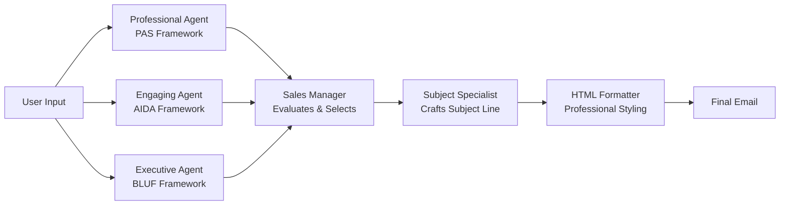
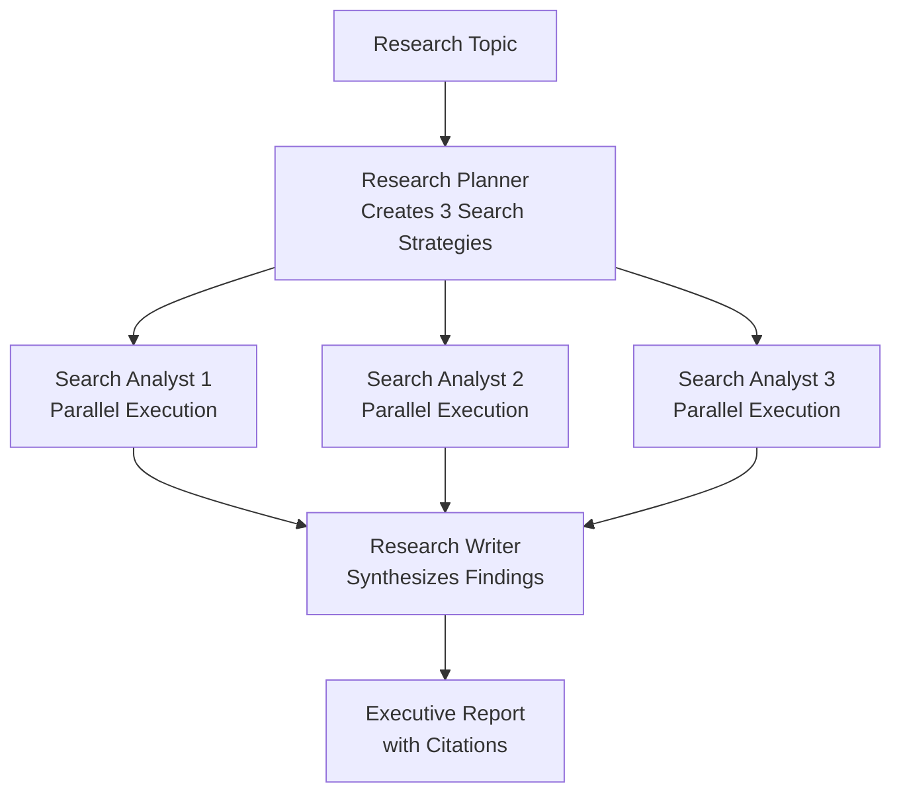
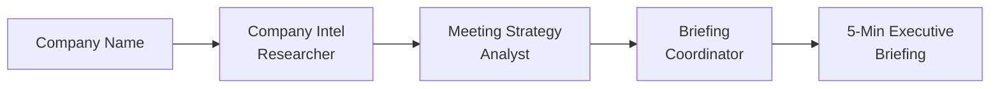

# AI Agent Platform

> **Professional-grade, full-stack orchestration platform for autonomous AI agents.** Built with production-ready architecture, enterprise security, and scalable multi-agent coordination.

[](https://www.python.org/downloads/)
[](https://fastapi.tiangolo.com/)
[](https://react.dev/)
[](https://opensource.org/licenses/MIT)

## 🎬 Live Demo



*Watch the Research Agents in action: planning multi-stage strategies, executing parallel searches, and generating executive reports.*

---

## 📋 Table of Contents

- [Overview](#-overview)
- [Key Features](#-key-features)
- [Architecture](#-architecture)
- [Agent Teams](#-agent-teams)
- [Tech Stack](#-tech-stack)
- [Getting Started](#-getting-started)
- [Configuration](#-configuration)
- [API Documentation](#-api-documentation)
- [Security & Rate Limiting](#-security--rate-limiting)
- [Deployment](#-deployment)
- [Development](#-development)
- [Testing](#-testing)
- [Troubleshooting](#-troubleshooting)
- [Contributing](#-contributing)
- [License](#-license)

---

## 🌟 Overview

The **AI Agent Platform** is a production-ready framework for building, orchestrating, and visualizing intelligent multi-agent systems. It demonstrates advanced AI agent coordination patterns, including:

- **Multi-framework support**: Seamlessly integrates CrewAI and OpenAI Agents SDK
- **Parallel execution**: Concurrent agent operations for optimal performance
- **Enterprise security**: PIN authentication, rate limiting, and API protection
- **Professional reporting**: Automated HTML report generation with styling
- **Scalable architecture**: Clean separation of concerns, modular design

### Use Cases

- **Sales Intelligence**: Generate personalized, high-conversion outreach emails using 6-agent collaboration
- **Meeting Preparation**: Automated company research and executive briefings via CrewAI
- **Deep Research**: Multi-perspective research with parallel search execution and academic citations

---

## ✨ Key Features

### 🤖 Multi-Agent Orchestration
- **3 specialized agent teams** with distinct workflows
- **Parallel execution** for search and analysis tasks
- **Agent handoff patterns** with structured data passing
- **Streaming console logs** for real-time progress tracking

### 🔒 Enterprise Security
- **PIN-based authentication** for demo/portfolio deployments
- **Multi-tier rate limiting**: 15-minute, hourly, and daily limits
- **IP-based tracking** with in-memory storage
- **CORS protection** with configurable origins
- **Rate limit headers** for transparency

### 🎨 Professional UI/UX
- **Tab-based navigation** for seamless agent switching
- **Fixed-height console** (400px) with auto-scroll
- **Markdown rendering** with syntax highlighting
- **Responsive design** with vanilla CSS
- **Error handling** with user-friendly messages

### 📊 Reporting Engine
- **Markdown to HTML conversion** with professional styling
- **Automatic file organization** with timestamped folders
- **Citation support** for research reports
- **Export functionality** for generated content

---

## 🏗️ Architecture

### System Overview



### Directory Structure

```
Agent_tools/
├── backend/
│   ├── app/
│   │   ├── agents/
│   │   │   ├── sales/              # 6-agent sales pipeline
│   │   │   │   ├── flow.py         # Orchestration logic
│   │   │   │   ├── personas.py     # Agent definitions
│   │   │   │   └── tools.py        # Email sending tools
│   │   │   ├── research/           # 3-agent research squad
│   │   │   │   ├── flow.py         # Parallel execution flow
│   │   │   │   ├── squad.py        # Agent configurations
│   │   │   │   └── tools.py        # Search tools
│   │   │   └── meeting_prep/       # CrewAI meeting intelligence
│   │   │       ├── flow.py         # CrewAI workflow
│   │   │       ├── src/            # CrewAI project structure
│   │   │       └── pyproject.toml  # CrewAI dependencies
│   │   ├── middleware/
│   │   │   └── rate_limiter.py     # Rate limiting logic
│   │   ├── core/
│   │   │   ├── config.py           # Environment configuration
│   │   │   └── utils.py            # Report generation utilities
│   │   ├── api.py                  # FastAPI unified API
│   │   └── main.py                 # CLI entry point
│   └── requirements.txt            # Python dependencies
├── frontend/
│   ├── src/
│   │   ├── components/
│   │   │   ├── LoginPage.jsx       # PIN authentication
│   │   │   ├── SalesForm.jsx       # Sales agent interface
│   │   │   ├── ResearchForm.jsx    # Research agent interface
│   │   │   ├── MeetingPrepForm.jsx # Meeting prep interface
│   │   │   ├── ProcessLog.jsx      # Real-time console
│   │   │   └── ResultsView.jsx     # Markdown renderer
│   │   ├── utils/
│   │   │   └── errorHandler.js     # Error handling utilities
│   │   ├── App.jsx                 # Main orchestrator
│   │   ├── App.css                 # Component styles
│   │   └── style.css               # Global styles
│   ├── package.json                # Node dependencies
│   └── vite.config.js              # Vite configuration
├── Reports/                        # Generated reports (timestamped)
├── .env.example                    # Environment template
├── RATE_LIMITS.md                  # Rate limiting documentation
├── RUNTHIS.md                      # Quick start guide
└── README.md                       # This file
```

### Data Flow



---

## 🤖 Agent Teams

### 1. Sales Intelligence Team (6 Agents)

**Framework**: OpenAI Agents SDK  
**Execution**: Sequential with manager evaluation



**Agents**:
1. **Professional Agent**: Problem-Agitation-Solution (PAS) framework
2. **Engaging Agent**: Attention-Interest-Desire-Action (AIDA) framework
3. **Busy Executive Agent**: Bottom Line Up Front (BLUF) - under 75 words
4. **Sales Manager**: Evaluates all 3 drafts, selects best approach
5. **Subject Specialist**: Creates compelling subject line
6. **HTML Formatter**: Converts to professional HTML email

**Key Features**:
- Multiple persuasion frameworks tested in parallel
- Manager-based quality control
- Professional HTML output with inline CSS
- Optional SendGrid integration for direct sending

**Technical Details**:
- **File**: `backend/app/agents/sales/flow.py`
- **Model**: Gemini 2.5 Flash
- **Average execution**: 30-45 seconds
- **Output**: HTML email + plain text version

---

### 2. Deep Research Team (3 Agents)

**Framework**: OpenAI Agents SDK  
**Execution**: Parallel search, sequential synthesis



**Agents**:
1. **Research Planner**: Breaks topic into 3 surgical search strategies
2. **Search Analyst** (3 instances): Executes searches in parallel, analyzes results
3. **Research Writer**: Synthesizes findings with academic citations

**Key Features**:
- **Parallel Intelligence**: 3 searches execute simultaneously using `asyncio.gather()`
- **Professional Citations**: Numbered references `[1]` linked to sources
- **Executive Format**: Key Takeaways + detailed sections
- **Auto-save**: Markdown + HTML reports with timestamps

**Technical Details**:
- **File**: `backend/app/agents/research/flow.py`
- **Search API**: Tavily AI (primary)
- **Model**: Gemini 2.5 Flash
- **Average execution**: 20-30 seconds
- **Output**: Markdown report + styled HTML

**Example Output Structure**:
```markdown
# Research Report: [Topic]
*Report generated: February 14, 2026*

## Key Takeaways
- Finding 1
- Finding 2
- Finding 3

## Section 1: [Aspect 1]
Detailed analysis... [1]

## Section 2: [Aspect 2]
Detailed analysis... [2]

## References
[1] Source URL - Description
[2] Source URL - Description
```

---

### 3. Meeting Prep AI (CrewAI)

**Framework**: CrewAI  
**Execution**: Sequential crew workflow



**Agents**:
1. **Company Intel Researcher**: Gathers overview, executives, recent news
2. **Meeting Strategy Analyst**: Identifies talking points and opportunities
3. **Briefing Coordinator**: Creates 5-minute executive briefing

**Key Features**:
- **Company Snapshot**: What they do, size, headquarters
- **Key People**: CEO and relevant executives
- **Talking Points**: Conversation starters from recent news
- **Smart Questions**: Demonstrate research and engagement

**Technical Details**:
- **File**: `backend/app/agents/meeting_prep/flow.py`
- **Search**: DuckDuckGo (via langchain-community)
- **Model**: Gemini 2.5 Flash (via google-genai)
- **CrewAI Version**: 1.8.1
- **Average execution**: 25-35 seconds
- **Output**: Structured briefing document

---

## 🛠️ Tech Stack

### Backend

| Technology | Version | Purpose |
|------------|---------|---------|
| **Python** | 3.12/3.13 | Runtime (3.14 incompatible with CrewAI) |
| **FastAPI** | Latest | REST API framework |
| **Uvicorn** | Latest | ASGI server |
| **CrewAI** | 1.8.1 | Multi-agent framework (Meeting Prep) |
| **OpenAI Agents SDK** | Latest | Agent framework (Sales, Research) |
| **Pydantic** | Latest | Data validation |
| **Tavily** | Latest | AI-powered search API |
| **DuckDuckGo Search** | 5.0.0+ | Web search (via langchain) |
| **SendGrid** | Latest | Email delivery (optional) |
| **python-dotenv** | Latest | Environment management |
| **Markdown** | Latest | Report generation |

### Frontend

| Technology | Version | Purpose |
|------------|---------|---------|
| **React** | 19.2.0 | UI framework |
| **Vite** | 7.2.4 | Build tool & dev server |
| **Axios** | 1.13.2 | HTTP client |
| **react-markdown** | 10.1.0 | Markdown rendering |
| **ESLint** | 9.39.1 | Code linting |
| **Vanilla CSS** | - | Styling (no framework) |

### LLM & APIs

- **Primary LLM**: Google Gemini 2.5 Flash (via OpenAI-compatible API)
- **Search**: Tavily AI (research), DuckDuckGo (meeting prep)
- **Email**: SendGrid (optional)

### Infrastructure

- **Backend hosting**: Render.com (recommended)
- **Frontend hosting**: Vercel (recommended)
- **Environment**: Python virtual environment (`.venv`)
- **CORS**: Configurable origins for local + production

---

## 🚀 Getting Started

### Prerequisites

> [!IMPORTANT]
> **Python Version**: Use **Python 3.12 or 3.13**. CrewAI is currently incompatible with Python 3.14.

**Required**:
- Python 3.12 or 3.13
- Node.js 18+ and npm
- Git

**API Keys** (at least one required):
- **Gemini API Key** (required) - [Get it here](https://aistudio.google.com/app/apikey)
- **Tavily API Key** (required for research) - [Get it here](https://tavily.com/)
- **SendGrid API Key** (optional, for email sending) - [Get it here](https://sendgrid.com/)

### Installation

#### 1. Clone the Repository

```bash
git clone https://github.com/Samrude1/Agentsquad.git
cd Agent_tools
```

#### 2. Backend Setup

```bash
# Create and activate virtual environment
python -m venv .venv

# Windows
.\.venv\Scripts\activate

# macOS/Linux
source .venv/bin/activate

# Install dependencies
pip install -r backend/requirements.txt
```

#### 3. Environment Configuration

```bash
# Copy example environment file
cp .env.example .env

# Edit .env with your API keys
# Required: OPENAI_API_KEY (Gemini), TAVILY_API_KEY
# Optional: SENDGRID_API_KEY, APP_PIN
```

**Example `.env`**:
```env
# Gemini API (via OpenAI-compatible endpoint)
OPENAI_API_KEY=your_gemini_api_key_here
OPENAI_BASE_URL=https://generativelanguage.googleapis.com/v1beta/openai/

# Search API
TAVILY_API_KEY=your_tavily_api_key_here

# Optional: Email sending
SENDGRID_API_KEY=your_sendgrid_api_key_here

# Optional: PIN authentication (default: 0000)
APP_PIN=0000

# Optional: Production frontend URL
FRONTEND_URL=https://your-frontend.vercel.app
```

#### 4. Frontend Setup

```bash
cd frontend
npm install
```

### Running the Application

You'll need **two terminal windows** running simultaneously:

#### Terminal 1: Backend (API Server)

```bash
# Ensure virtual environment is activated
.\.venv\Scripts\activate  # Windows
source .venv/bin/activate  # macOS/Linux

# Start FastAPI server
uvicorn backend.app.api:app --reload
```

**Backend runs at**: `http://localhost:8000`

**API Documentation**: `http://localhost:8000/docs` (Swagger UI)

#### Terminal 2: Frontend (React App)

```bash
cd frontend
npm run dev
```

**Frontend runs at**: `http://localhost:5173`

### First Use

1. **Open browser**: Navigate to `http://localhost:5173`
2. **Enter PIN**: Default is `0000` (configured in `.env`)
3. **Select agent**: Choose from tabs (Sales, Research, Meeting Prep)
4. **Submit request**: Fill form and click submit
5. **Watch progress**: Real-time logs appear in console
6. **View results**: Markdown-rendered output with download option

> **💡 Quick Start Tip**: See [`RUNTHIS.md`](RUNTHIS.md) for a condensed startup guide.

---

## ⚙️ Configuration

### Environment Variables

| Variable | Required | Default | Description |
|----------|----------|---------|-------------|
| `OPENAI_API_KEY` | ✅ Yes | - | Gemini API key |
| `OPENAI_BASE_URL` | ✅ Yes | `https://generativelanguage.googleapis.com/v1beta/openai/` | Gemini endpoint |
| `TAVILY_API_KEY` | ✅ Yes | - | Tavily search API key |
| `SENDGRID_API_KEY` | ❌ No | - | SendGrid email API key |
| `APP_PIN` | ❌ No | `0000` | PIN for authentication |
| `FRONTEND_URL` | ❌ No | - | Production frontend URL for CORS |

### Rate Limiting Configuration

Edit `backend/app/middleware/rate_limiter.py`:

```python
self.limits = {
    "agent": {
        "per_15min": 5,   # Agent requests per 15 minutes
        "per_hour": 10,   # Agent requests per hour
        "per_day": 25,    # Agent requests per day
    },
    "general": {
        "per_minute": 30,  # General requests per minute
        "per_hour": 500,   # General requests per hour
    }
}
```

See [`RATE_LIMITS.md`](RATE_LIMITS.md) for detailed documentation.

### CORS Configuration

Edit `backend/app/api.py`:

```python
allowed_origins = [
    "http://localhost:5173",  # Local development
    "http://localhost:4173",  # Local preview
]

# Add production URL via environment variable
if production_url := os.getenv("FRONTEND_URL"):
    allowed_origins.append(production_url)
```

---

## 📡 API Documentation

### Authentication

**Endpoint**: `POST /api/auth/verify`

**Request**:
```json
{
  "pin": "0000"
}
```

**Response**:
```json
{
  "status": "success",
  "message": "Authenticated"
}
```

---

### Sales Agent

**Endpoint**: `POST /api/sales/draft`

**Request**:
```json
{
  "contact_name": "John Doe",
  "company_name": "Acme Corp",
  "prospect_email": "john@acme.com",
  "sender_name": "Jane Smith",
  "product_description": "AI-powered analytics platform"
}
```

**Response**:
```json
{
  "status": "success",
  "draft": {
    "subject": "Transform Your Analytics with AI",
    "html_body": "<html>...</html>",
    "plain_body": "Plain text version..."
  }
}
```

---

### Research Agent

**Endpoint**: `POST /api/research`

**Request**:
```json
{
  "topic": "AI agents in 2026"
}
```

**Response**:
```json
{
  "status": "success",
  "result": "# Research Report: AI agents in 2026\n\n..."
}
```

---

### Meeting Prep Agent

**Endpoint**: `POST /api/meeting-prep`

**Request**:
```json
{
  "topic": "Microsoft Corporation"
}
```

**Response**:
```json
{
  "status": "success",
  "result": "# Meeting Preparation: Microsoft Corporation\n\n..."
}
```

---

### Health Check

**Endpoint**: `GET /health`

**Response**:
```json
{
  "status": "healthy",
  "version": "1.0"
}
```

---

### Interactive API Documentation

FastAPI provides automatic interactive documentation:

- **Swagger UI**: `http://localhost:8000/docs`
- **ReDoc**: `http://localhost:8000/redoc`

---

## 🛡️ Security & Rate Limiting

### PIN Authentication

- **Purpose**: Protect demo/portfolio deployments from unauthorized access
- **Configuration**: Set `APP_PIN` in `.env` (default: `0000`)
- **Bypass**: Remove or leave empty to disable authentication
- **Frontend**: Login page appears if PIN is configured

### Rate Limiting

**Design Philosophy**: Allow thorough testing while preventing abuse

#### Agent Endpoints (`/api/sales/`, `/api/research`, `/api/meeting-prep`)

| Window | Limit | Rationale |
|--------|-------|-----------|
| 15 minutes | 5 requests | Test all 3 agents + retries |
| 1 hour | 10 requests | Thorough testing session |
| 24 hours | 25 requests | Generous daily allowance |

#### General Endpoints (`/api/auth/`, `/api/config/`)

| Window | Limit | Rationale |
|--------|-------|-----------|
| 1 minute | 30 requests | Normal UI interactions |
| 1 hour | 500 requests | Prevent automated attacks |

#### Rate Limit Headers

Every response includes:
- `X-RateLimit-Remaining-15min`: Remaining requests (15-minute window)
- `X-RateLimit-Remaining-Day`: Remaining requests (daily window)

#### Error Response (429 Too Many Requests)

```json
{
  "error": "Rate limit exceeded",
  "message": "Rate limit exceeded: 5 agent requests per 15 minutes. Please wait before trying again.",
  "type": "agent",
  "hint": "This is a demo application with usage limits to prevent abuse. Thank you for understanding!"
}
```

### Cost Protection

Rate limits protect free-tier API quotas:

- **Gemini Free Tier**: 15 req/min, 1500 req/day
- **Tavily Free Tier**: 1000 searches/month
- **25 agent requests/day** ≈ 75 API calls (well within limits)

### Security Best Practices

✅ **Implemented**:
- Environment variable secrets (never committed)
- CORS with explicit origin whitelist
- Rate limiting with IP tracking
- Input validation via Pydantic models
- Error handling without sensitive data leakage

⚠️ **For Production** (beyond demo scope):
- Replace in-memory rate limiter with Redis
- Add HTTPS/TLS termination
- Implement JWT-based authentication
- Add request logging and monitoring
- Set up API key rotation
- Add database for persistent storage

---

## 🚢 Deployment

### Recommended Stack

- **Backend**: [Render.com](https://render.com) (Free tier available)
- **Frontend**: [Vercel](https://vercel.com) (Free tier available)

### Backend Deployment (Render)

1. **Create Web Service**:
   - Repository: `https://github.com/Samrude1/Agentsquad`
   - Root Directory: `backend`
   - Build Command: `pip install -r requirements.txt`
   - Start Command: `uvicorn app.api:app --host 0.0.0.0 --port $PORT`

2. **Environment Variables**:
   ```
   OPENAI_API_KEY=your_gemini_key
   OPENAI_BASE_URL=https://generativelanguage.googleapis.com/v1beta/openai/
   TAVILY_API_KEY=your_tavily_key
   APP_PIN=your_secure_pin
   FRONTEND_URL=https://your-frontend.vercel.app
   ```

3. **Health Check**:
   - Path: `/health`
   - Expected response: `{"status": "healthy"}`

### Frontend Deployment (Vercel)

1. **Import Project**:
   - Repository: `https://github.com/Samrude1/Agentsquad`
   - Root Directory: `frontend`
   - Framework: Vite

2. **Environment Variables**:
   ```
   VITE_API_URL=https://your-backend.onrender.com
   ```

3. **Build Settings**:
   - Build Command: `npm run build`
   - Output Directory: `dist`

4. **Update API URL**:
   - Edit `frontend/src/App.jsx` or use environment variable
   - Change `http://localhost:8000` to production backend URL

### Post-Deployment

1. **Test health endpoint**: `https://your-backend.onrender.com/health`
2. **Test frontend**: `https://your-frontend.vercel.app`
3. **Verify CORS**: Check browser console for CORS errors
4. **Test rate limiting**: Make multiple requests to verify limits
5. **Monitor logs**: Check Render/Vercel dashboards for errors

---

## 💻 Development

### Project Structure Philosophy

- **Feature-first organization**: Agents grouped by functionality
- **Separation of concerns**: API, agents, middleware, core utilities
- **Modular design**: Each agent team is self-contained
- **Shared utilities**: Common functions in `core/`

### Adding a New Agent Team

1. **Create agent directory**: `backend/app/agents/your_agent/`
2. **Implement flow**: `flow.py` with `async def run_your_agent(input: str)`
3. **Define agents**: Create agent configurations (personas, squad, etc.)
4. **Add tools**: Implement custom tools in `tools.py`
5. **Register endpoint**: Add route in `backend/app/api.py`
6. **Create frontend form**: Add component in `frontend/src/components/`
7. **Update navigation**: Add tab in `App.jsx`

### Code Style

**Backend (Python)**:
- Follow PEP 8
- Use type hints
- Async/await for I/O operations
- Docstrings for public functions

**Frontend (JavaScript)**:
- ESLint configuration included
- Functional components with hooks
- Prop validation
- CSS modules or vanilla CSS (no Tailwind by default)

### Running Tests

**Backend**:
```bash
# Test rate limiting
python test_rate_limits.py

# Test model connection
python verify_model.py
```

**Frontend**:
```bash
cd frontend
npm run lint
```

### Debugging

**Backend logs**:
```bash
# Verbose logging
uvicorn backend.app.api:app --reload --log-level debug
```

**Frontend logs**:
- Open browser DevTools → Console
- Check Network tab for API calls
- Inspect rate limit headers

---

## 🧪 Testing

### Manual Testing Checklist

#### Authentication
- [ ] PIN login works with correct PIN
- [ ] PIN login fails with incorrect PIN
- [ ] PIN bypass works when `APP_PIN` is empty

#### Sales Agent
- [ ] Form submission with all fields
- [ ] Form submission with minimal fields (contact_name, company_name optional)
- [ ] Email preview renders correctly
- [ ] HTML formatting is professional
- [ ] Subject line is compelling

#### Research Agent
- [ ] Topic submission triggers research
- [ ] Parallel searches execute (check logs)
- [ ] Citations are numbered and linked
- [ ] Markdown renders correctly
- [ ] Report saves to `Reports/` folder

#### Meeting Prep Agent
- [ ] Company name submission works
- [ ] Briefing includes company overview
- [ ] Key people are identified
- [ ] Talking points are relevant
- [ ] Output is concise (5-minute read)

#### Rate Limiting
- [ ] 6th request in 15 minutes is blocked
- [ ] Rate limit headers are present
- [ ] Error message is user-friendly
- [ ] Limits reset after time window

#### UI/UX
- [ ] Tab navigation works smoothly
- [ ] Process log auto-scrolls
- [ ] Process log height is fixed (400px)
- [ ] Results render markdown correctly
- [ ] Error messages display properly

### Automated Testing

**Rate Limiter Test**:
```bash
python test_rate_limits.py
```

**Expected output**:
```
✅ 15-minute limit test passed
✅ Hourly limit test passed
✅ Daily limit test passed
✅ General endpoint limits passed
```

---

## 🔧 Troubleshooting

### Common Issues

#### 1. "Module not found" errors

**Problem**: Python can't find backend modules

**Solution**:
```bash
# Ensure you're in the project root
cd Agent_tools

# Activate virtual environment
.\.venv\Scripts\activate  # Windows
source .venv/bin/activate  # macOS/Linux

# Reinstall dependencies
pip install -r backend/requirements.txt
```

---

#### 2. "CrewAI incompatible with Python 3.14"

**Problem**: Using Python 3.14

**Solution**:
```bash
# Check Python version
python --version

# Install Python 3.12 or 3.13
# Then recreate virtual environment
python3.12 -m venv .venv
```

---

#### 3. CORS errors in browser

**Problem**: Frontend can't connect to backend

**Solution**:
1. Check `backend/app/api.py` CORS configuration
2. Ensure frontend URL is in `allowed_origins`
3. For production, set `FRONTEND_URL` environment variable

---

#### 4. Rate limit errors immediately

**Problem**: Rate limiter has stale data

**Solution**:
```bash
# Restart backend server (clears in-memory storage)
# Press Ctrl+C in backend terminal
uvicorn backend.app.api:app --reload
```

---

#### 5. API key errors

**Problem**: Invalid or missing API keys

**Solution**:
1. Check `.env` file exists in project root
2. Verify API keys are correct (no extra spaces)
3. Restart backend after changing `.env`

**Test Gemini key**:
```bash
python verify_model.py
```

---

#### 6. Frontend build errors

**Problem**: Vite build fails

**Solution**:
```bash
cd frontend
rm -rf node_modules package-lock.json
npm install
npm run dev
```

---

#### 7. Reports not saving

**Problem**: `Reports/` folder doesn't exist

**Solution**:
```bash
# Create Reports directory
mkdir Reports
```

---

### Debug Mode

**Enable verbose logging**:

```bash
# Backend
uvicorn backend.app.api:app --reload --log-level debug

# Frontend
npm run dev -- --debug
```

### Getting Help

1. **Check logs**: Backend terminal and browser console
2. **Review documentation**: API docs at `http://localhost:8000/docs`
3. **Test endpoints**: Use Swagger UI for manual API testing
4. **Check rate limits**: Inspect `X-RateLimit-*` headers
5. **Verify environment**: Ensure `.env` is configured correctly

---

## 🤝 Contributing

This project is designed for demonstration and portfolio use. Contributions are welcome!

### Development Workflow

1. Fork the repository
2. Create a feature branch (`git checkout -b feature/amazing-feature`)
3. Commit changes (`git commit -m 'Add amazing feature'`)
4. Push to branch (`git push origin feature/amazing-feature`)
5. Open a Pull Request

### Code Quality Standards

- **Backend**: PEP 8 compliance, type hints, docstrings
- **Frontend**: ESLint passing, component documentation
- **Testing**: Manual test checklist completed
- **Documentation**: Update README for new features

---

## 📄 License

This project is licensed under the **MIT License**.

```
MIT License

Copyright (c) 2026 Samrude1

Permission is hereby granted, free of charge, to any person obtaining a copy
of this software and associated documentation files (the "Software"), to deal
in the Software without restriction, including without limitation the rights
to use, copy, modify, merge, publish, distribute, sublicense, and/or sell
copies of the Software, and to permit persons to whom the Software is
furnished to do so, subject to the following conditions:

The above copyright notice and this permission notice shall be included in all
copies or substantial portions of the Software.

THE SOFTWARE IS PROVIDED "AS IS", WITHOUT WARRANTY OF ANY KIND, EXPRESS OR
IMPLIED, INCLUDING BUT NOT LIMITED TO THE WARRANTIES OF MERCHANTABILITY,
FITNESS FOR A PARTICULAR PURPOSE AND NONINFRINGEMENT. IN NO EVENT SHALL THE
AUTHORS OR COPYRIGHT HOLDERS BE LIABLE FOR ANY CLAIM, DAMAGES OR OTHER
LIABILITY, WHETHER IN AN ACTION OF CONTRACT, TORT OR OTHERWISE, ARISING FROM,
OUT OF OR IN CONNECTION WITH THE SOFTWARE OR THE USE OR OTHER DEALINGS IN THE
SOFTWARE.
```

---

## 🙏 Acknowledgments

- **CrewAI**: Multi-agent framework for meeting prep workflow
- **OpenAI Agents SDK**: Agent orchestration for sales and research
- **Google Gemini**: Powerful LLM via OpenAI-compatible API
- **Tavily**: AI-powered search for research agents
- **FastAPI**: Modern Python web framework
- **React**: UI library for interactive frontend

---

## 📞 Contact

**Built with ❤️ by Samrude1**

- **GitHub**: [@Samrude1](https://github.com/Samrude1)
- **Repository**: [Agentsquad](https://github.com/Samrude1/Agentsquad)

---

## 🗺️ Roadmap

### Planned Features

- [ ] **Persistent storage**: PostgreSQL for conversation history
- [ ] **User authentication**: JWT-based multi-user support
- [ ] **Agent marketplace**: Plugin system for custom agents
- [ ] **Real-time collaboration**: WebSocket for multi-user sessions
- [ ] **Advanced analytics**: Dashboard for agent performance metrics
- [ ] **Export formats**: PDF, DOCX report generation
- [ ] **Voice interface**: Speech-to-text for agent inputs
- [ ] **Mobile app**: React Native companion app

### Known Limitations

- **In-memory rate limiting**: Resets on server restart (use Redis for production)
- **No persistence**: Reports saved locally, no database
- **Single-user**: No multi-tenancy support
- **Synchronous UI**: No WebSocket streaming (uses polling)

---

**⭐ If you find this project useful, please consider giving it a star on GitHub!**
