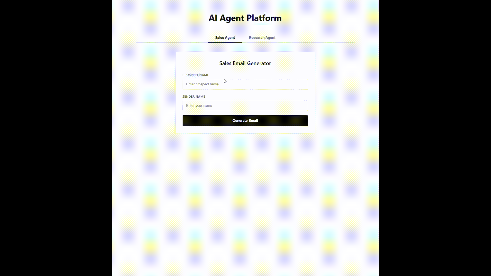

# Agentic Business Intelligence Platform

> **Enterprise-Grade Multi-Agent Orchestration.** A production-ready platform for deploying, managing, and visualizing autonomous AI agent teams.

## 🎬 Live System



*System in action: The Deep Research Team planning multi-stage strategies, executing parallel web operations, and generating executive-level synthesis.*

---

## 🤖 Meet the Agents

### 📧 The Sales Intelligence Team (6 Agents)
*A collaborative team specialized in high-conversion outreach.*

| Agent | Role |
|-------|------|
| Professional Agent | PAS (Problem-Agitation-Solution) framework |
| Engaging Agent | AIDA (Attention-Interest-Desire-Action) framework |
| Busy Executive Agent | BLUF (Bottom Line Up Front) - under 75 words |
| Sales Manager | Evaluates all 3 drafts, picks the best |
| Subject Specialist | Crafts catchy, high-conversion subject lines |
| HTML Formatter | Converts to clean, professional HTML |

**Key Features:**
- **Competitive Drafting**: 3 personas write competing emails, manager picks the winner
- **Smart Recipient Handling**: Adapts greetings for individuals ("Dear John") vs companies ("To the team at Sony")
- **Human-in-the-Loop**: Draft Mode lets you preview, edit, or discard before sending
- **Zero Placeholders**: 100% finished emails, every time

### 🔍 The Deep Research Team (3 Agents)
*A research squad capable of synthesizing the entire web into actionable insights.*

| Agent | Role |
|-------|------|
| Research Planner | Breaks topic into 3 surgical search strategies |
| Search Analyst | Executes searches + analyzes results (×3 parallel) |
| Research Writer | Synthesizes with citations and executive summary |

**Key Features:**
- **Parallel Intelligence**: 3 searches execute simultaneously via Tavily AI
- **Professional Citations**: Numbered references linked to named sources
- **Executive Reports**: Key Takeaways + deep dive sections
- **Organized Outputs**: Unique timestamped folders for each project

---

## 🧠 The Engine: Multi-Agent Orchestration

Unlike "black box" AI wrappers, this platform features:
- **Flow-Based Orchestration**: Agents run in parallel where possible, avoiding SDK turn limits
- **Live Process Stream**: Real-time visibility into agent collaboration
- **Custom Workflows**: Standardized `.agent/workflows/` for code quality
- **AI Skills**: Project knowledge stored in `.agent/skills/` for consistent expansion

---

## 🎨 UI/UX Features

**Professional Console Interface:**
- **Fixed-Height Console**: Agent process logs displayed in a scrollable 400px window
- **Smart Positioning**: Console appears below agent panels, not replacing them
- **Internal Scrollbar**: Scroll through agent steps without moving the entire page
- **Live Status Indicators**: Real-time "RUNNING" status with animated pulse dot
- **Persistent Form**: Input fields remain visible during agent execution (disabled state)

---

# 🛠️ Technical Reference

## 🏗️ Architecture

```
Agent_tools/
├── backend/
│   ├── app/
│   │   ├── core/           # Shared config & model management
│   │   ├── agents/
│   │   │   ├── sales/      # 6-agent sales pipeline
│   │   │   └── research/   # 3-agent research squad
│   │   ├── api.py          # FastAPI endpoints (draft/send/research)
│   │   └── main.py         # CLI entry point
│   └── requirements.txt
└── frontend/
    ├── src/
    │   ├── components/     # React UI components
    │   └── App.jsx         # Tab-based orchestrator
    └── package.json
```

## 📜 License & Usage

This repository is primarily a **Showcase** of my technical skills and architectural capability.
While the code is public to demonstrate code quality:

1.  **Strictly Personal:** The design, copy, and specific implementation details are tailored to my personal brand.
2.  **No License for Reuse:** Please do not fork, copy, or deploy this site as your own portfolio or application.
3.  **Inquiries:** For business inquiries or collaboration, please contact me via LinkedIn.

*Looking for the live site? Visit my Portfolio.*

## 🧪 Tech Stack

- **Backend**: Python 3.10+, FastAPI, OpenAI Agents SDK (Gemini 2.5 Flash)
- **Search Engine**: Tavily AI
- **Email Delivery**: SendGrid
- **Frontend**: React 18, Vite, Vanilla CSS

## 🛠️ Development & Scalability

This platform is built for **extensibility**:
- **Modular Agents**: Add new capabilities in `backend/app/agents/`
- **Flow Orchestration**: `asyncio.gather()` for parallel agent execution
- **Visual Logs**: Frontend automatically maps to agent lifecycle steps

---

## 🤝 Contributing

Designed for demonstration and portfolio use.
Built with ❤️ by Samrude1.
Built with ❤️ by Samrude1.
